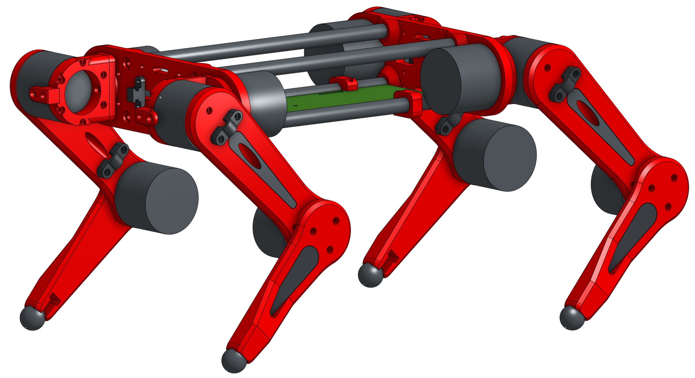
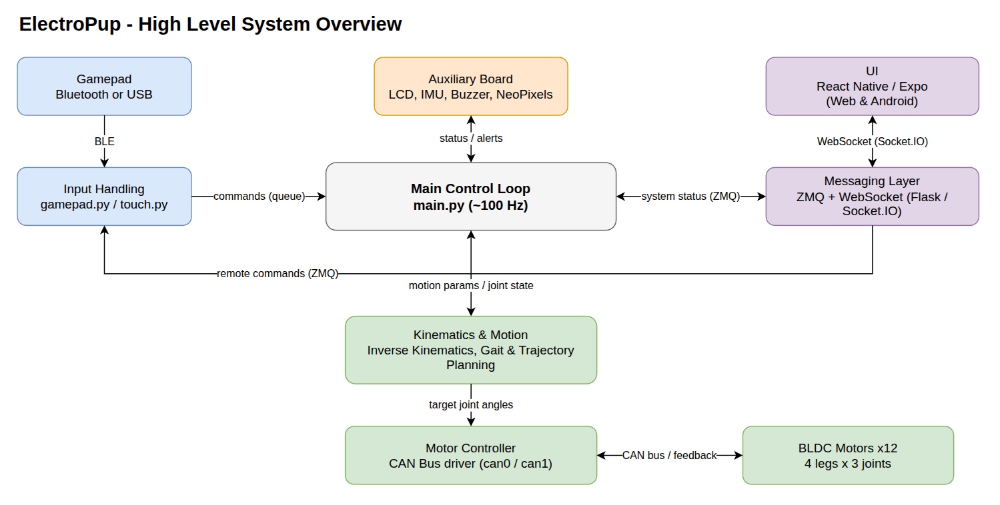
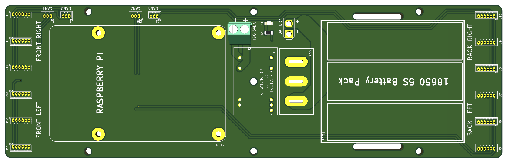
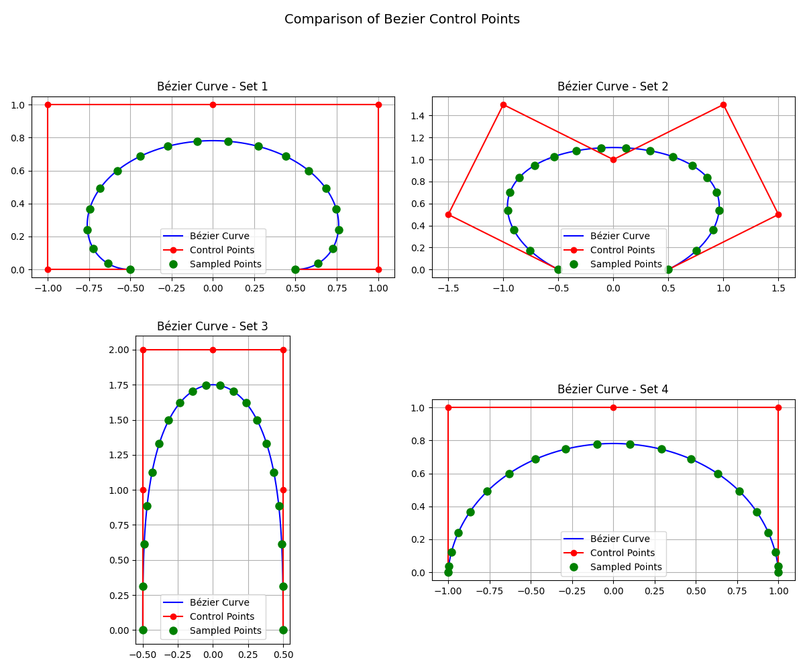
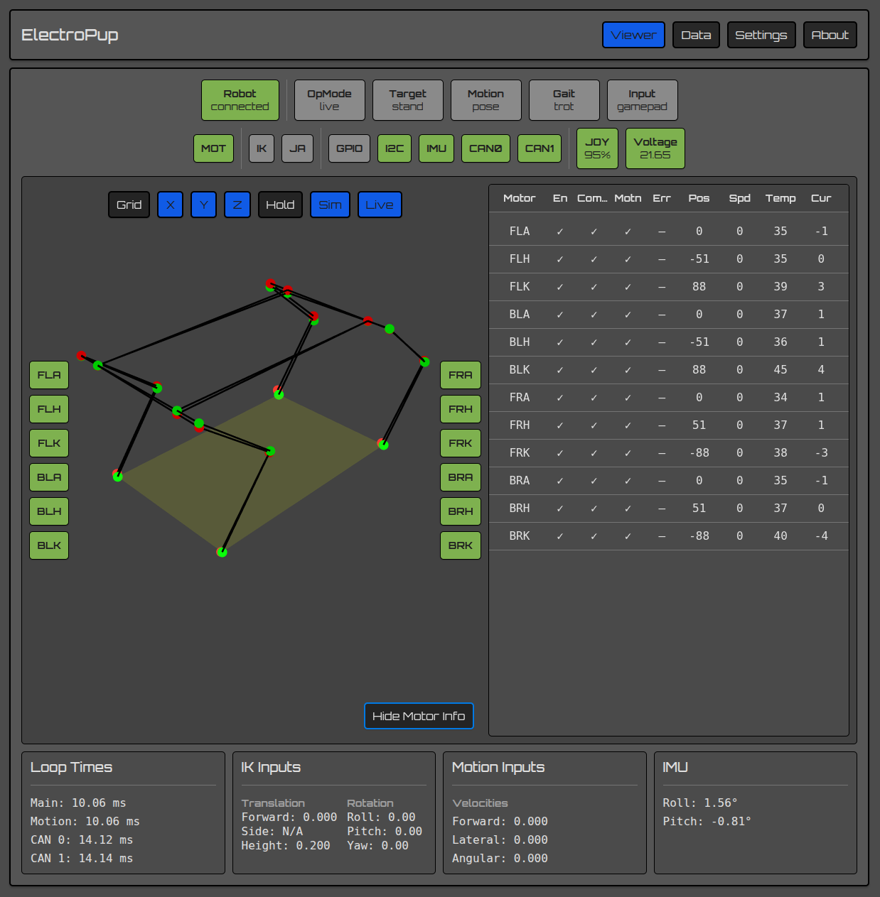
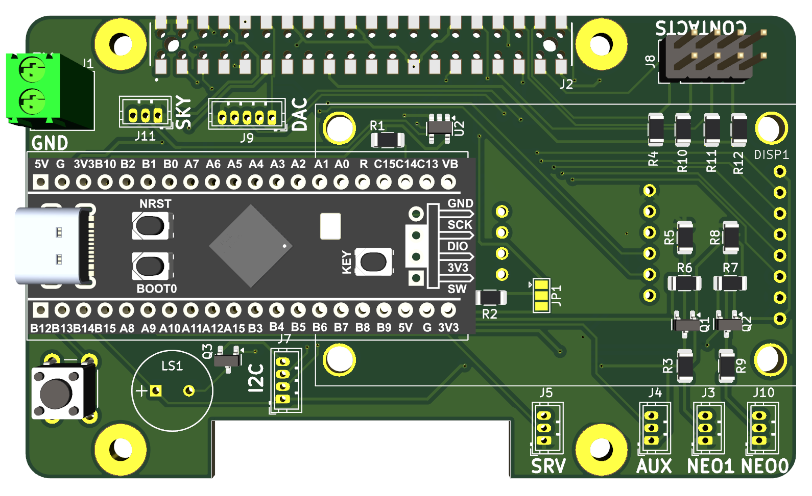
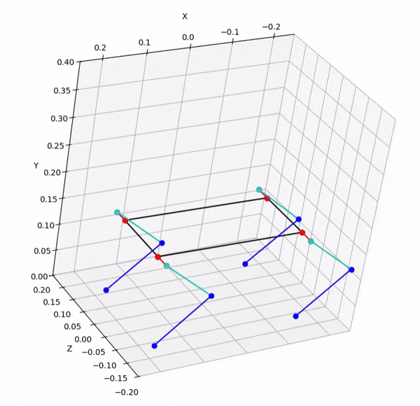

# Light Doggo — Development Journal

## August 21: Day 0 — Research and finding inspiration

ok, i've been obsessed with quadruped robots for the past few weeks, so today i finally decided to stop just watching videos and actually start building one.

spent basically the whole day going down rabbit holes on YouTube, GitHub, Hackaday, etc. I was trying to figure out what motors people were using, how they were controlling them, and what would actually be realistic for a project that i could afford.

some of the main things i looked into:

* BLDC vs servo vs stepper motors
* Raspberry Pi vs ESP32 vs STM32
* CAN bus for motor communication
* existing open-source quadruped projects
* how other people were doing the leg kinematics

Stanford Pupper was one of the first projects i looked at. The kinematics and overall design are really cool, but the cost is way beyond what i wanted to spend.

then there was SpotMicro, which is much more accessible and open source, but it uses servos. I really wanted to try BLDC motors instead.

eventually i found the LingKong MG4010E motors on AliExpress. They have encoders, CAN communication at 1 Mbps, and around 2.5 N·m of torque. They're about $35 each, so 12 of them would come out to roughly $420.

that's still a lot of money, but honestly not terrible for a 12-DOF quadruped.

for the controller, i decided to go with a Raspberry Pi 5. It's definitely overkill in some ways, but having enough processing power for the control software, UI, simulation, etc. without adding another computer seemed worth it.

by the end of the day, the rough plan was:

* Raspberry Pi 5 as the main computer
* 12 BLDC motors
* CAN bus
* custom PCBs
* Python for the control software
* MuJoCo for simulation

I couldn't find the exact image that originally inspired me, but at this point i had a pretty clear idea of what i wanted to build.

**Time spent: 8 hours**

---

## August 22: Repo setup and renaming everything

today was mostly GitHub/repo cleanup.

I found an existing project that had some really useful stuff in it, especially the KiCad files, firmware structure and CAN bus code. The problem was that it was originally made for a micromouse, so a huge amount of it had absolutely nothing to do with a quadruped.

basically:

```text
git clone upstream-repo
# look through everything
# realise most of it is useless
# delete a ridiculous amount of stuff
# rename everything
```

the maze-solving code, wheel encoders, line sensors, etc. obviously had to go. But the CAN communication code and some of the motor-driver structure were actually really useful.

I probably spent way too long deciding what to keep.

eventually i ended up with something roughly like:

* `firmware/auxillary` — STM32 code for the LCD/auxiliary board
* `pcbs` — KiCad projects
* `cad` — OnShape exports and STLs
* `src/src` — Python control code and simulation
* `docs` — GitHub Pages documentation

using an existing project definitely saved me a lot of time. Writing the entire CAN communication layer from scratch would have been painful.



**Time spent: 6 hours**

---

## August 23: Documentation and CAD

today i realised that if i didn't start documenting things now, i'd probably forget why i made half of the decisions in the first place.

started writing the README and documenting the basic hardware:

* Raspberry Pi 5
* 12 × BLDC motors
* 6S Li-Ion battery
* 9-axis IMU

then somehow the README turned into documenting basically the entire software architecture.

I also made the architecture diagram in Draw.io. It took much longer than i expected, but it actually helped me understand how everything was supposed to fit together.

the current setup has the Python control software talking to the CAN controller, which then communicates with the motors. I'm using four separate CAN networks, basically one per leg. It's probably more complicated than strictly necessary, but it makes things easier to organise.

after that i spent most of the afternoon working on the CAD in OnShape.

the body is basically two plates with mounting points for the Raspberry Pi, battery and electronics. One of the annoying parts was trying to keep everything compact while also keeping the centre of mass reasonably low.

the legs took even longer.

each leg has 3 DOF:

* hip abduction/adduction
* hip flexion/extension
* knee flexion/extension

I had to make custom motor brackets so that the motor axes lined up properly with the joint axes. I used the dimensions from the MG4010E datasheet for this.

it's starting to actually look like a robot now, which is pretty satisfying.



**Time spent: 8 hours**

---

## August 24: PCBs are finally done (hopefully)

the Power Carrier board went through about four revisions today.

the main headache was figuring out how to route power for 12 motors while also fitting four CAN networks onto the board.

I added solder jumpers so that the CAN networks can be combined in different ways. That way, if i don't need all four CAN channels, i can merge some of them instead.

not sure if i'll actually need that flexibility, but i'd rather have the option now than redesign the board later.

the auxiliary board was another story.

originally i thought i'd use an STM32 for basically everything — motor control, LCD, buzzer, neopixels, etc.

then i looked at the Raspberry Pi 5 GPIO/I2C situation again and realised i was making things unnecessarily complicated.

most of that stuff can just be handled directly by the Pi.

so now the STM32 mostly exists to handle the LCD and a few auxiliary functions.

kind of an important lesson from today:

just because i *can* add another microcontroller doesn't mean i should.

one more chip means another firmware project, another communication interface, another thing that can break, and another thing i have to debug.



**Time spent: 7 hours**

---

## August 25: KINEMATICS ACTUALLY WORK

today was probably the most satisfying day so far.

I finally got the inverse kinematics working in MuJoCo.

and somehow... it actually looks like a dog walking.

the basic idea is that each leg has three joints, and the inverse kinematics calculates what angles those joints need to be at to put the foot at a particular position.

the difficult part was getting the foot trajectory right.

for straight-line walking i'm using Bezier curves. The control points basically determine how far forward the foot moves and how high it lifts during the swing.

for turning, i'm projecting the normal trajectory onto a curved path. In simple terms, i'm taking the straight walking path and bending it around a circle.

the first version of the simulation was terrible.

the robot was basically bouncing everywhere because i hadn't properly set the masses and inertial properties in the MuJoCo XML. I was using placeholder values, which turned out to be a pretty bad idea.

after fixing those values, things got considerably better. It's still nowhere near perfect, but it can stand and take a few steps without completely losing its mind.

one of the things i really want is to compare the simulated robot with the actual motor feedback. If the simulation and real robot line up, it'll give me a lot more confidence that the kinematics and control code are correct.



**Time spent: 8 hours**

---

## August 26: The UI is finally useful

the UI is finally at the point where i can actually use it for debugging instead of just looking pretty.

it's built with React Native + Expo and currently shows:

* joint positions
* motor currents
* sensor data
* control-loop timing
* gamepad inputs
* motor feedback

the coolest part is probably the 3D visualisation.

I can display the simulated quadruped and the real motor feedback at the same time, so i can actually see whether the robot is doing what the control software thinks it's doing.

I initially wanted to push all the motor feedback at full speed, but that made the WebSocket connection pretty unhappy.

connections kept dropping whenever too much data was being sent.

eventually i throttled the motor feedback to around 50 Hz. That seems to be a much better compromise.

the app runs on the web through Expo while i'm developing, which is really convenient because i don't have to keep deploying it to my phone every time i change something.

Android will work too, although the 3D visualisation is limited because WebGL support isn't as nice there.



**Time spent: 6 hours**

---

## August 27: Firmware and website

today was mostly firmware.

got the STM32 firmware compiling and running on the Black Pill dev board.

the auxiliary board is responsible for things like:

* powering the Raspberry Pi
* LCD
* buzzer
* neopixels

the LCD was probably the most annoying part.

it's an SPI display, so actually sending data isn't too difficult. The annoying part was the initialisation sequence. There are a bunch of register writes that have to happen in the right order before the display actually works.

I found a reference implementation in an Adafruit library and adapted it instead of trying to figure out the entire LCD controller from scratch.

the buzzer was much easier. It's just PWM, although i added variable pitch so it can play different tones.

eventually i'd like to make it do some kind of bark sound because obviously a robot dog needs to bark.

also got the GitHub Pages site set up and added the BOM.

the current estimated cost is around $700 for the whole robot.

that's definitely not cheap, but considering it's a 12-DOF quadruped with custom PCBs, BLDC motors, sensors and a Raspberry Pi, i'm pretty happy with it.



**Time spent: 7 hours**

---

## August 28: Cleanup and final polish

today was mostly boring stuff, but necessary boring stuff.

first, i switched the project license from Apache 2.0 to MIT.

the main reason was just simplicity. For a small personal open-source project, MIT seemed easier to understand and maintain.

then i cleaned up the README and fixed some weird character encoding problems that were making some things render incorrectly on GitHub.

also discovered that KiCad had dumped a bunch of backup files and other generated files into the repo.

so yeah, spent a while cleaning those up and adding things to `.gitignore`.

I also finished a few documentation sections:

* motor calibration
* gamepad controls
* wiring
* setup instructions
* demo

the motor calibration script, `zero-motors.py`, is probably one of the more useful little tools in the repo. It connects to the motors over CAN, reads their current encoder positions and lets me set their zero offsets.

finally added the wireframe demo GIF too.

it's only the simulation walking in a circle, but honestly it looks pretty cool.



and that's basically the first development sprint done.

there's still a ridiculous amount left to do — especially getting the real robot walking reliably — but at least at this point Light Doggo isn't just an idea and some CAD files anymore.

**Time spent: 6 hours**
