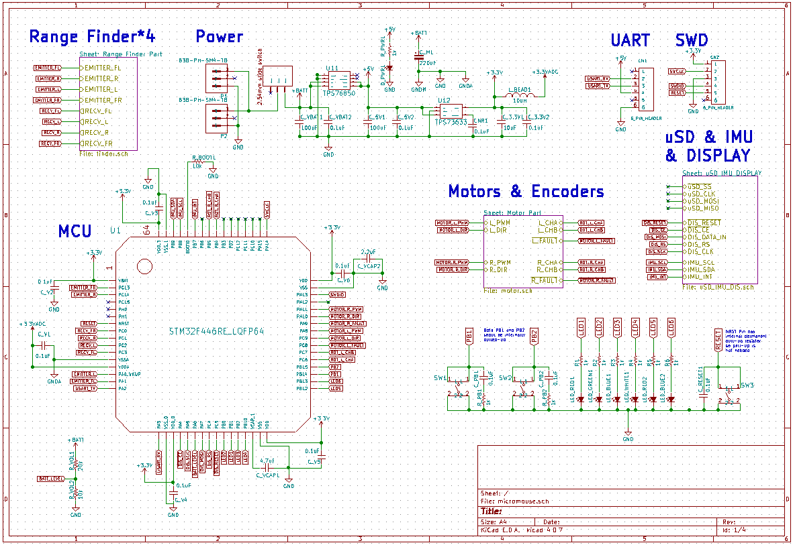
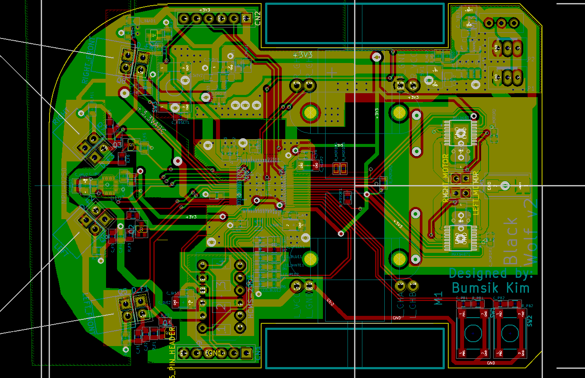
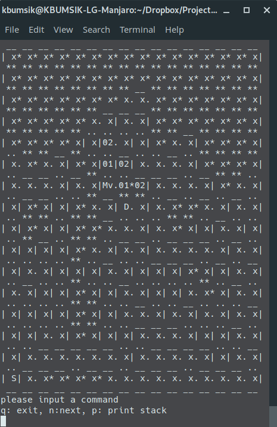

# MiceyMousey

**MiceyMousey** is a micromouse — a self-driving maze-solving robot — based on kbumsik's open-source micromouse project (2nd place, IEEE Region 1 Micromouse 2019, GPLv2.1: https://github.com/kbumsik/WolfieMouse). It runs a custom STM32F446 PCB with hand-drawn symbols and footprints, FreeRTOS firmware with its own flood-fill maze solver, IR range sensors, motor encoders, and a debug display.

## Features

- STM32F446RE (Cortex-M4, 180 MHz)
- 2x DC motors with quadrature encoders
- MAX14871 motor driver
- MPU-9250 9-axis IMU
- VL6180X time-of-flight range sensors
- TCA9545A I2C multiplexer
- HCMS-2901 4-digit display
- FreeRTOS + own maze-solving algorithm

## Contents

| File | What it is |
|------|-----------|
| [MiceyMousey.kicad_sch](MiceyMousey.kicad_sch) | Schematic (blank — rebuild with the custom symbols, see reference/) |
| [MiceyMousey.kicad_pcb](MiceyMousey.kicad_pcb) | Board layout (original competition board, loads in KiCad 10) |
| [lib/](lib/) | 26 custom symbols + 27 custom footprints |
| [reference/](reference/) | Original 2017 schematic files (legacy format, read-only) |
| [production/](production/) | Original gerber zips from the competition board |
| [3D_Model/](3D_Model/) | Wheels, skate, motor seat, sensor housing STLs |
| [firmware/](firmware/) | C++ firmware (FreeRTOS + maze solver) |
| [simulation/](simulation/) | Maze solver simulator |
| [docs/](docs/) | Original documentation |
| [tools/](tools/) | Sensor data tools + Vagrant build env |
| [BOM.xlsx](BOM.xlsx) | Component BOM |

## BOM

| Reference | Value | Footprint | Qty |
|-----------|-------|-----------|-----|
| U1 | STM32F446RE | footprints_micromouse:STM32F446_LQFP64 | 1 |
| U2 | MAX14871 motor driver | footprints_micromouse:... | 1 |
| U3 | MPU-9250 IMU | footprints_micromouse:MPU-9250 | 1 |
| U4 | TCA9545A I2C mux | footprints_micromouse:... | 1 |
| U5, U6 | TPS73633 / TPS76850 LDOs | footprints_micromouse:... | 2 |
| DISP1 | HCMS-2901 display | footprints_micromouse:HCMS-2903 | 1 |
| X1, X2 | VL6180X range sensors | footprints_micromouse:VL6180X_POLOLU... | 2 |
| M1, M2 | Geared DC motors w/ encoders | footprints_micromouse:... | 2 |

Full list with exact part numbers in [BOM.xlsx](BOM.xlsx).

## Firmware

The firmware runs FreeRTOS on the STM32F446. It's the original competition code — maze solving, PID speed control, and sensor handling live in `firmware/src/`. Build needs the GNU ARM toolchain (or the provided Vagrant env).

| Module | What it does |
|--------|-------------|
| `src/maze/` | Maze representation, flood-fill solver, position controller |
| `src/board/miceymousey/` | Motor, encoder, range sensor drivers |
| `src/module/` | Control loop, display, logging |

## Building it

1. Source all parts from BOM.xlsx
2. Fabricate the PCB from production/ gerbers (or redesign — the .kicad_pcb is editable)
3. Print the 3D parts from 3D_Model/
4. Solder the board, wire motors + sensors
5. Flash the firmware with an ST-Link (or use the Vagrant env to build)
6. Drop it in a 16x16 maze and let it run

## Schematic

## PCB

## Simulation

## Credits

Based on [kbumsik's micromouse project](https://github.com/kbumsik/WolfieMouse) — IEEE Region 1 Micromouse 2018/2019 — licensed GPLv2.1. Huge thanks to kbumsik for open-sourcing the whole thing: PCB, firmware, and docs.