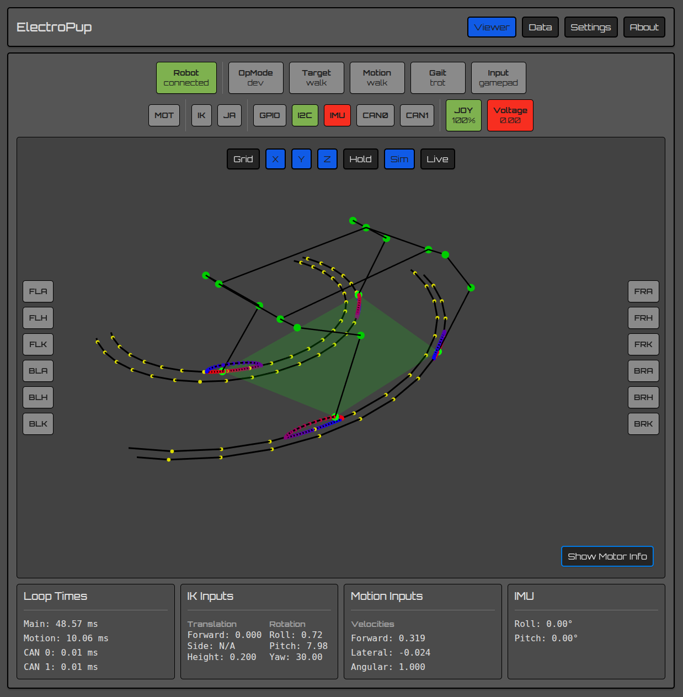
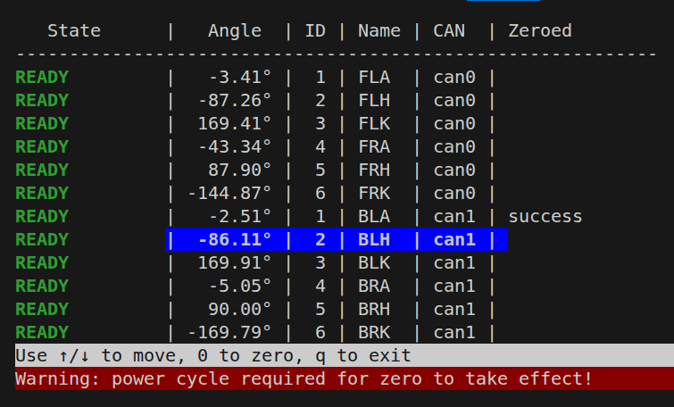
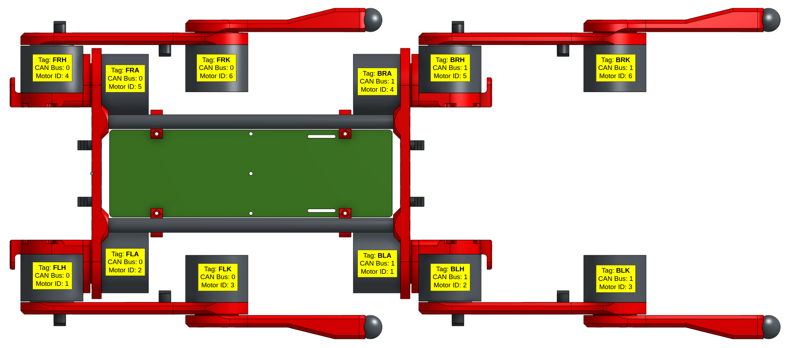
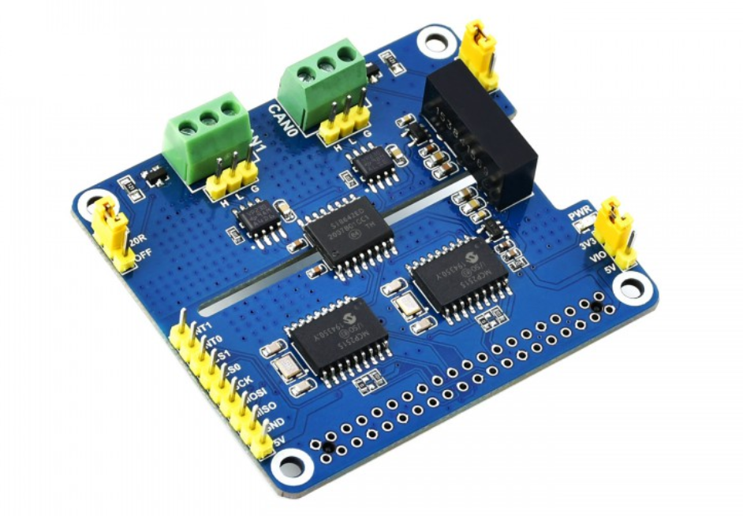

# Light Doggo

Light Doggo is a DIY quadruped robot using 'low cost' BLDC motors.

## Basic Specifications

* RPi 5
* 12x BLDC motors
* Auxiliary board w/LCD display
* 9-axis accelerometer/gyro sensor
* 6s Li-Ion battery, ~72wH

Light Doggo's control system is coded in Python.

# Docs

See the docs directory for a setup guide, bill of materials (BOM), 3D printed parts info, and miscellaneous design notes.

# UI

The UI shows the status of the entire system: quadruped joint positions, subsystem status, motor information, inputs, sensors, loop times, etc. The above image shows the simulated quadruped overlapped with real quadruped (based on motor feedback).

The above image shows a virtual circle the feet follow to walk in a circle and the bezier curves used for moving the feet up and down.

The UI is built from the React Native Framework using Expo and runs on web. The app will run on Android without the plot. The entire system runs in dev mode so you can run the simulation and UI from a development PC without physical hardware.

# Kinematics

Inverse kinematics, leg position, and gamepad inputs are verified using the UI.

### Trajectories

Bezier curves, sin arcs, and curvature projection are used to generate trajectories. The plots below are examples of control points configurations.

The output of `./src/plot/bezier_curve_plot.py`

Rotation is achieved by projecting a linear trajectory onto a curve. The plots are of example projection calculations.

The output of `./src/plot/projection_plot.py`

# Simulation

Simulation is performed in MuJoCo and can be started by running `./src/sim.sh`. Currently, input controlls are only provided by the gamepad.

The `ElectroPup.xml` currently does not have approximate masses or inertial so the simulated quadruped is rather bouncy.

# Electronics

## PCBs

PCBs are designed in KiCad v8(is compatible with KiCad v10 or higher).

### Power Carrier

The Power Carrier PCB provides a main on/off power switch and distributes power to the motor headers. The Power Carrier creates four CAN bus networks one for each leg. Solder jumpers allow merging the front two legs into a single network and the back two legs into another single network.

### Auxiliary Board

The auxiliary board is optional and not required for the quadruped to operate.

Features:

* Powers RPi via terminal header
* LCD display
* Buzzer (variable pitch)
* NeoPixel strips
* RC Servo channel
* I2C expansion
* Button to control LCD and shutdown Raspberry Pi before power off

Provides direct connection to RPi header for the following breakouts:

* IMU (BNO055 via I2C)
* 4x contact inputs or GPIO
* I2S for sound driver (future barks 🐶)
* SBUS to use RC transmitter if BLE gamepad fails in RF congested areas

# Software Architecture

Electropup's software architecture was purposely designed to be simple and to bypass the pain points of using ROS2. A major downside of this single service architecture is needing to sit and stand the quadruped on every software change vs being able to restart individual services quickly without affecting others (i.e. the motors). However, with the simulated quadruped and UI, most development is not performed on a live quadruped.

# Motors

The motors are MG4010E-i10v3 actuators made by LingKong (LKMTECH).

### Specifications

* voltage: 7.4-32V
* communication: CAN 1Mbps
* rated torque: 2.5 N.m
* max torque: 4.5 N.m
* rated current: 3.5 A
* max power: 140 W
* gear ratio: 1:10
* encoders: 18-bit motor, 14-bit reducer
* size: 53mm diameter, 41mm tall
* weight: 238 grams

### MG4010E-i10v3 Pros

* easy to use configuration software over non-proprietary USB to UART hardware
* readable CAN bus communication documentation
* small physical size that works well with the desired frame size of ElectroPup
* non-proprietary power/communications connector (JST-ZH 6-POS)

### MG4010E-i10v3 Cons

* configuration software is Windows only
* closed source firmware
* foreign sourced, complicating the warranty process
* CAN unable to configure all parameters
* UART required to configure error thresholds, motor torque limits (for compliance), etc.
* some motors are more difficult to turn by hand and require slightly more operational current

Future projects will prioritize ODrive compatible drivers.

### Motor Zero Positions

### Motor Tags

### Motor Calibration

The zero-motors.py script is a quick way to verify correct motor configuration and to zero the motors.

# CAN Bus

The CAN bus controller is a 2-Channel Isolated CAN Expansion HAT from waveshare.

Each CAN controller drives six motors with an average motor update rate of ~70 Hz. This includes fetching encoder position, setting target angle/speed, and getting error states.

# Gamepad

ElectroPup was coded with a PS4 controller in mind, however xBox, PS5, Logitech gamepads may be used with minor software modifications.

# Environment and IDEs

There are three hardware/software environments described below.

### PC/Laptop - Plotting, Simulation, and Development

Desktop or laptop computer running Ubuntu Desktop (or your preferred flavor of Linux).

Software: VSCode (with remote SSH and PlatformIO extensions), Drawio, LibreOffice, KiCad, OrcaSlicer, Chrome/Firefox

### Raspberry Pi - Quadruped Hardware Driver

The quadruped compute is a Raspberry Pi 5.

The OS is Raspberry Pi OS Lite (Bookworm 64-bit), which is headless, so all development is performed using remote SSH.

### STM32 - Auxiliary Board

An STM32F401 Black Pill dev kit operates the auxiliary board to display the motor and system status on a LCD display and interface with other peripherals such as the buzzer.

Uses VSCode with PlatformIO on the PC/Laptop for development.

# CAD

Parts are modeled using OnShape which provides free web-based full access for non-commercial use. The links below should have export permissions to allow copying the workspace.

* [Assembly](https://cad.onshape.com/documents/b02341d4ebb7f3e9dd488186)
* [Legs](https://cad.onshape.com/documents/6da583196278caf8e90b3122)
* [Body](https://cad.onshape.com/documents/280c24f1b6bdbe8246159786)
* [Hips](https://cad.onshape.com/documents/428031d0c98bf15dcc9f5c8c)
* [Tools](https://cad.onshape.com/documents/3677b35bffbfedb5a3fd2b26)
* [Parts](https://cad.onshape.com/documents/6d4d4e21394ee725ee8ddb38)
* [PCB](https://cad.onshape.com/documents/c8a855826c37bd92b89d9f0e)
* [Neopixels](https://cad.onshape.com/documents/567292ac55c75b2efa25b7d5)

# Battery Pack

The battery is a custom 6S1P Li-Ion using 18650s with a load balancing BMS. The 18650's are Sanyo branded and rated at 3250mAH each providing an estimated 72Wh.

# Future Improvements

This is a general improvement list for future updates or revisions.

* add upside down control (the frame supports walking even after flipped)
* apply IMU for smoother gaits
* add center of mass calculations for smoother gaits
* swap battery and RPi positions for better center of mass
* swap foot lag bolt from SAE to metric
* add curvature to lower leg
* add speaker for barks
* add a tail
* add voltage/current sensor (such as an INA228)
* remove STM32 from aux board and use RPI directly for buzzer, LCD, etc.

# License

This project is licensed under the [MIT License](LICENSE).

#Credits

All the fundings will be allocated by Hack Club.
Thank you Star Dance and Hack Club for their absolute support while making Light Doggo!

